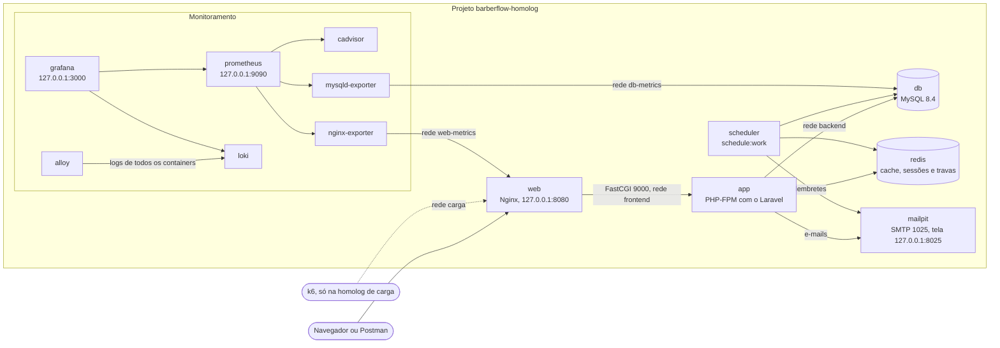
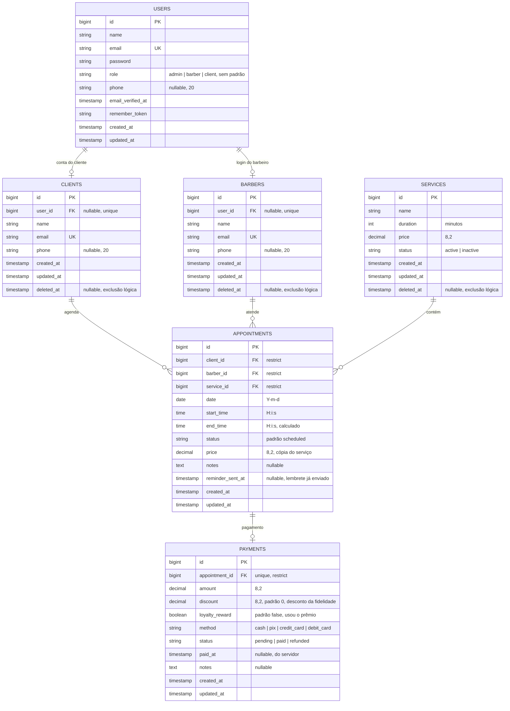

# Arquitetura do BarberFlow

Projeto da disciplina **Arquitetura de Microsserviços e Desenvolvimento de APIs**.
Equipe: Eduardo Romano, Jose Coene, Leonam e Manoel.

## 1. Visão geral

O BarberFlow é uma plataforma de gestão e agendamento para barbearias. O foco do produto é ajudar a barbearia a preencher horários vazios, reduzir faltas, aumentar a recorrência de clientes e acompanhar o faturamento.

Nesta etapa o sistema é uma **API REST monolítica modular** em Laravel: um único serviço com camadas bem separadas (rotas, controllers, models, banco). Essa escolha mantém o MVP simples e robusto, e deixa a base pronta para, no futuro, evoluir para um SaaS multiempresa.

O porquê do monólito modular, a diferença com os "microsserviços conteinerizados" do `Sistema Cloud.pdf` e quando separar um serviço estão no [ADR 0001](adr/0001-monolito-modular.md).

O projeto atende a duas disciplinas: Arquitetura de Microsserviços e Desenvolvimento de APIs (a API, as regras e as telas, neste documento) e Computação em Nuvem (containers, Terraform, CI/CD e observabilidade, com os guias em [`docs/nuvem/`](nuvem/ARQUITETURA-NUVEM.md)). O [relatório técnico](RELATORIO-TECNICO.md) junta as duas, com as evidências da entrega final.

## 2. Stack

| Camada | Tecnologia | Motivo |
|---|---|---|
| Backend / API | Laravel 13 (PHP 8.4.1+) | Roteamento de API, validação e ORM prontos; estrutura MVC alinhada ao esboço inicial |
| Banco de dados | MySQL 8.4 (SQLite em memória nos testes e, se quiser, no local) | Banco relacional, adequado a agenda, clientes e financeiro |
| ORM | Eloquent | Evita SQL manual e facilita relacionamentos futuros |
| Autenticação | Laravel Sanctum | Sessão (cookie + CSRF) para as telas e token Bearer para a API, no mesmo pacote e com as mesmas regras de perfil |
| Telas | Blade + Bootstrap 5.3 via Vite | Telas servidas pelo próprio Laravel, que chamam a API com a sessão do navegador |
| Testes | PHPUnit 12 (testes de feature) e k6 (carga) | Valida os endpoints de ponta a ponta e o tempo de resposta com muitos usuários ao mesmo tempo |
| Containers | Docker (uma imagem em estágios, `docker/php/Dockerfile`), Docker Compose e Nginx | O mesmo código roda igual no computador, na homolog e na AWS |
| Cache, sessões e travas | Redis na homolog e ElastiCache Valkey na AWS | As instâncias dividem as sessões e as travas do agendador (`onOneServer()`) e das migrations (`--isolated`) |
| Infraestrutura | Terraform na AWS: VPC, ALB, Auto Scaling, RDS, ElastiCache, ECR, SSM e CloudWatch | Infraestrutura como código, testada sem conta da AWS (`terraform test` com o provider simulado) |
| CI/CD | GitHub Actions | Testes, build, varreduras e Terraform em todo pull request; deploy por tag, com OIDC |
| Observabilidade | Prometheus, Grafana, Loki e Alloy na homolog; CloudWatch na AWS | Métricas, painel, logs centralizados e alarmes |

## 3. Fluxo de uma requisição

```
Cliente HTTP (Postman, telas no navegador, app)
        │
        ▼
Nginx (container web)     → entrega sozinho o CSS e o JS do Vite e manda o resto ao PHP-FPM
        │                   (container app); na AWS, o ALB vem antes dele
        ▼
Middlewares               → cabeçalhos de segurança, limite de requisições (throttle:api),
                            sessão e CSRF para as telas (statefulApi) e login (auth:sanctum)
        │
        ▼
routes/api.php            → Route::apiResource(...) mapeia verbo + URL para o controller
        │
        ▼
Controller                → confere a permissão (Gate::authorize + Policy) e valida a
                            requisição ($request->validate)
        │
        ▼
Model (Eloquent)          → lê/grava no MySQL (sem as linhas excluídas)
        │
        ▼
Resposta JSON             → 200, 201, 204, 401, 403, 404, 405, 409, 422, 429 ou 503
```

Padrões adotados:

- **`Route::apiResource`**: gera as 5 rotas REST de cada recurso com uma única linha.
- **Route model binding**: os métodos `show`, `update` e `destroy` recebem o model já carregado (ex.: `Service $service`). Se o ID não existe ou foi excluído, a API responde `404` com `{"message": "Registro não encontrado."}`.
- **Validação nos controllers**: regras declaradas em `$request->validate(...)`. Falhas retornam `422` com a lista de erros por campo, em português.
- **Limites iguais aos do banco**: `name` e `email` até 255 caracteres, `phone` até 20, `duration` de 5 a 480 minutos e `price` até 999999.99 (o máximo do `decimal(8,2)`). Assim um valor grande demais vira `422`, e não um erro 500 do MySQL.
- **E-mail em uso, também no mesmo instante**: a regra `unique` lê o banco antes da gravação, e dois pedidos com o mesmo e-mail ao mesmo tempo passam os dois por ela. Quem barra o segundo é o índice `unique` do banco, e o `App\Exceptions\EmailTakenException::guard()` troca essa recusa pelo mesmo `422` da regra ("Este e-mail já está cadastrado.", no campo `email`), em vez de um erro 500. Vale para clientes, barbeiros (com o login deles, que grava `users.email`) e o cadastro de conta. A recusa de outro índice continua sendo erro.
- **Mesmo estilo nos controllers**: `store` devolve `201` com o registro, `show` e `update` devolvem o registro e `destroy` devolve `204` sem corpo. A agenda e os pagamentos não têm `destroy`: cancelar é `PATCH /appointments/{id}/status` e estornar é `PATCH /payments/{id}/status`, que devolvem o registro.
- **Listagens paginadas**: `index` devolve uma página por vez, em ordem de nome, com `page` (1 a 100000), `per_page` (1 a 100, padrão 15) e `search`. Serviços aceitam também `status`. Os agendamentos saem em ordem de data e horário, sem `search`, com os filtros `date`, `from`, `to`, `barber_id`, `client_id`, `status` e `without_payment` (concluídos sem pagamento). Os pagamentos saem do atendimento mais recente para o mais antigo, com os filtros `from`, `to` (pela data do atendimento), `method`, `status`, `barber_id` e `client_id`, e trazem também `totals` (quantidade e soma de cada status com os mesmos filtros, em todas as páginas). A resposta tem `data` (itens), `links` (primeira, última, anterior e próxima página) e `meta` (página atual, última página, total etc.), montada pelo `JsonResource::collection()` do Laravel, sem classe de Resource própria. O teto do `page` existe porque a conta do offset (`(page - 1) * per_page`) estoura o inteiro do PHP com uma página enorme e viraria erro 500.
- **Respostas sempre em JSON** para qualquer rota `api/*` (configurado em `bootstrap/app.php`). Lá também ficam as mensagens de `404` (registro ou rota inexistente) e `405` (método errado) em português, sem o nome da classe do model que o Laravel colocaria na mensagem.
- **Mass assignment protegido**: cada model declara `$fillable` com os campos permitidos.
- **Casts no model**: `Service` converte `duration` para inteiro e `price` para texto com 2 casas (`"35.00"`), então o JSON sai igual no SQLite e no MySQL.

### Idioma e fuso horário

- **Português do Brasil:** `APP_LOCALE=pt_BR`. As mensagens de validação, autenticação, senha e paginação ficam em `lang/pt_BR/` e as frases soltas do framework em `lang/pt_BR.json`, escritas à mão a partir dos arquivos em inglês do Laravel. O bloco `attributes` do `validation.php` troca o nome técnico do campo pelo nome em português (`name` vira "nome"). O inglês continua como reserva (`APP_FALLBACK_LOCALE=en`).
- **Fuso de São Paulo:** `APP_TIMEZONE`, com padrão `America/Sao_Paulo` em `config/app.php`. O `now()` do PHP e as datas gravadas no banco usam a hora de Brasília, e o JSON entrega as datas em UTC (ISO 8601 com `Z`), que qualquer cliente converte. A agenda (horários de atendimento) depende desse fuso.

### Saúde da aplicação

| Rota | O que confere | Quem usa |
|---|---|---|
| `GET /up` | só que o PHP responde | o balanceador de carga e o Auto Scaling (health check do ALB) |
| `GET /api/health` | banco (`select 1`) e cache (grava e lê uma chave) | monitoramento, deploy, testes de carga e de resiliência |

O `/up` continua raso de propósito: se ele dependesse do banco, uma queda do banco faria o Auto Scaling trocar instâncias que estão boas, sem parar. Com o banco congelado e o pool do PHP-FPM cheio, porém, até o `/up` espera um processo livre (seção 8). O `/api/health` responde `200` com `{"status":"ok"}` ou `503` dizendo qual conferência falhou, só com `ok` ou `falhou`; o motivo vai para o log, nunca para a resposta. Ele é aberto (sem login) e fica fora do limite de requisições da API (`withoutMiddleware('throttle:api')`), para o monitoramento e o deploy não receberem `401` nem `429`.

### Autenticação: sessão nas telas, token na API

| | Telas (navegador) | API (Postman e outros sistemas) |
|---|---|---|
| Entrada | formulário `/login` (`Auth\SessionController`) | `POST /api/login` (`AuthController`) |
| Credencial | cookie da sessão + token CSRF | token Bearer com o prefixo `barberflow_` |
| Validade | a da sessão (`SESSION_LIFETIME`), ou mais com "lembrar de mim" | `SANCTUM_EXPIRATION` minutos (padrão 480). O `sanctum:prune-expired` apaga os vencidos todo dia |
| Saída | Sair (formulário `POST /logout` com `@csrf`) | `POST /api/logout`, que apaga o token da chamada |

As telas chamam a própria API com a sessão: o `statefulApi()` do `bootstrap/app.php` faz o Sanctum abrir a sessão e conferir o CSRF quando o `Referer` vem de um host de `SANCTUM_STATEFUL_DOMAINS`. O `pages.js` manda o `X-CSRF-TOKEN` (lido da meta `csrf-token` do layout) e o `Referer` (`referrerPolicy: 'same-origin'`). Assim nenhum token fica guardado no navegador, onde um script injetado poderia lê-lo. Na tela, `401` e `419` levam ao login com o aviso de sessão expirada, e `403` mostra "Você não tem permissão para esta ação.".

O login das telas e o da API seguem as mesmas regras (`App\Services\Auth\LoginAttempt`): a senha é conferida antes de abrir a sessão ou criar o token, conta sem acesso é recusada e há limite de tentativas. No login, a sessão ganha um id novo (`session()->regenerate()`), para um id roubado antes do login não servir depois.

Senha trocada encerra os outros logins: o `authenticateSessions()` guarda na sessão um resumo da senha, e a sessão cai na próxima requisição quando a senha muda. A troca de senha pela conta apaga os outros tokens; a redefinição por e-mail apaga todos os tokens, as sessões e o "lembrar de mim".

### Perfis e permissões

`users.role` guarda o perfil (`App\Enums\UserRole`): `admin`, `barber` (barbeiro) ou `client` (cliente). A coluna não tem padrão, e usuário sem perfil não entra. O `role` não está no `$fillable` do `User`: o código grava o perfil com `forceFill`, para ninguém virar admin mandando `role` numa requisição.

- **Policies** (`app/Policies`), uma por recurso, com `before()` liberando o admin. Os controllers chamam `Gate::authorize(...)`, inclusive para regras por campo (`BarberPolicy::viewContactDetails`, `ServicePolicy::viewInactive` e `ClientPolicy::changeEmail`) e por ação (`PaymentPolicy::recordFor`, para qual agendamento o barbeiro registra, `PaymentPolicy::changeStatus`, que deixa o barbeiro só marcar como pago, e `AppointmentPolicy::sendReminder`, que deixa o barbeiro mandar o lembrete só dos agendamentos dele). A fidelidade usa a mesma regra do ver cliente (`ClientPolicy::view`).
- **Gates das telas** (`AppServiceProvider`): `access-admin`, `access-staff` (admin e barbeiro) e `access-client`. As rotas de `routes/web.php` usam `can:` e o menu do layout usa `@can`. O dashboard não tem model, então a regra dele é o Gate `view-dashboard` (só o admin), que o `GET /api/dashboard` confere.
- **Login do barbeiro:** nasce quando o admin define a senha no cadastro do barbeiro e fica ligado por `barbers.user_id`. Excluir o barbeiro apaga o login, os tokens e as sessões dele.

| Recurso | Admin | Barbeiro | Cliente |
|---|---|---|---|
| Serviços | tudo | ver | ver os ativos |
| Barbeiros | tudo (o campo `password` cria ou redefine o login) | ver | ver só nome e id (sem e-mail e telefone) |
| Clientes | tudo | ver, criar, editar | só o próprio cadastro, sem listar os outros |
| Agendamentos | tudo | só os da própria agenda (ver, agendar, remarcar e mudar o status) | agendar para si (até 3 ativos, `CLIENT_MAX_ACTIVE_APPOINTMENTS`), ver os próprios, cancelar até 2h antes (`CLIENT_CANCEL_MIN_HOURS`) |
| Lembrete ("Enviar lembrete agora") | de qualquer agendamento | só dos agendamentos da própria agenda | não, nem do próprio horário |
| Pagamentos | tudo (registrar, com ou sem o prêmio da fidelidade, corrigir, marcar como pago e estornar) | registrar (com ou sem o prêmio) e ver os da própria agenda, e marcar como pago um pendente deles; não corrige nem estorna | ver os próprios |
| Fidelidade | ver a de qualquer cliente | ver a de qualquer cliente | ver a própria |
| Dashboard | ver | não | não |

Menu das telas por perfil: o admin vê Dashboard (a tela inicial dele), Agenda, Agendar, Pagamentos, Clientes, Barbeiros e Serviços; o barbeiro vê Agenda (a tela inicial dele), Agendar, Pagamentos e Clientes; o cliente vê Agendar, Meus horários (a tela inicial dele) e Minha conta. As telas do cliente (`/booking` e `/my-appointments`) usam o Gate `access-client` e exigem o e-mail confirmado; Pagamentos (`/payments`) usa o `access-staff` e o Dashboard (`/dashboard`), o `access-admin`.

### Conta de cliente

Decisão do Leonam (13/11/2026): o cliente também tem conta e vai agendar sozinho. Admin e barbeiro continuam agendando para quem chega no balcão.

1. **Cadastro** (`/register` ou `POST /api/register`): a conta nasce com o perfil `client` e o e-mail não confirmado (`MustVerifyEmail`), e o BarberFlow manda o link de confirmação. O e-mail não aceita acento nem outro caractere fora do ASCII (regra `ascii`; veja "E-mail parecido no MySQL", em "Histórico e LGPD (exclusão lógica)").
2. **Confirmação:** o link é assinado e vale 60 minutos. Ao confirmar, o listener `LinkClientToVerifiedUser` liga a conta ao cliente que já tem o mesmo e-mail (no MySQL, maiúsculas e minúsculas não contam) ou cria um cadastro novo, e a ligação fica em `clients.user_id`. Quando o cliente achado já tem outra conta, ou quando o e-mail dele só é igual ao da conta para o banco (no MySQL, a busca por `maria@gmáil.com` acha `maria@gmail.com`), a conta fica sem cadastro e o log registra só os ids. A busca pelo e-mail trava (`lockForUpdate`): se a barbearia cadastra um cliente com o mesmo e-mail no mesmo instante, um pedido espera o outro, e a barbearia recebe o `422` de e-mail em uso ou a conta é ligada ao cadastro que ela acabou de criar, nunca um `500`. No MySQL, a busca que não acha a linha trava o intervalo do índice `unique` de `clients.email` onde o e-mail entraria (gap lock), e o insert da barbearia espera a confirmação terminar; quando a barbearia grava primeiro, a busca com trava espera o commit dela. No SQLite local, as transações `IMMEDIATE` fazem uma gravação esperar a outra, com o mesmo resultado. Provado na segunda rodada de acabamento (15/11/2026) pelo `EmailVerificationConcurrencyTest` (só no MySQL) e com duas sessões de verdade num MySQL 8.4 descartável. Duas contas que confirmam o e-mail no mesmo instante, com e-mails que caem no mesmo intervalo do índice, pegam as duas essa trava, e o insert de cada uma espera o da outra: o MySQL desfaz uma delas por deadlock (`1213`, provado com duas sessões de verdade), e o listener roda a transação dela de novo, até 3 vezes (`LinkClientToVerifiedUser::ATTEMPTS`). Na segunda vez a outra já gravou, e a conta é ligada ao cadastro que nasce. Sem repetir, a resposta era `500` e a conta ficava confirmada e sem cadastro, porque a confirmação não roda outra vez. O `EmailVerificationConcurrencyTest` confere a repetição com o erro do MySQL no primeiro insert, porque o deadlock de verdade precisa de dois processos. Com dois cliques no link (a mesma conta confirmando duas vezes ao mesmo tempo), o segundo pedido acha o cadastro que o primeiro acabou de ligar a ela e não faz nada, sem o aviso de "outra conta" no log (`RegistrationTest`).
3. **Telas do cliente e rotas da API:** exigem o e-mail confirmado (middleware `verified`). Na API ficam de fora só as rotas da própria conta (`/user`, `/user/password`, `/logout` e o reenvio do link). As rotas da agenda ficam no mesmo grupo, e toda rota nova da API também entra nele.

A ligação só acontece depois da confirmação porque é ela que prova que a pessoa é dona do e-mail. Sem isso, qualquer um veria o histórico de outra pessoa só digitando o e-mail dela no cadastro. Pelo mesmo motivo, o cliente não muda o e-mail do próprio cadastro (nem manda o campo, mesmo vazio): um e-mail trocado para o de outra pessoa abriria caminho para tomar a conta pelo "esqueci minha senha".

O "esqueci minha senha" usa o broker de senha do Laravel (tabela `password_reset_tokens`, link de 60 minutos) e responde sempre a mesma coisa, com e-mail cadastrado ou não, e também com o servidor de e-mail fora do ar (a falha vai para o log sem o endereço; veja "Quedas do banco e do cache").

**Conta criada com o e-mail de outra pessoa.** O dono do e-mail recebe "Este e-mail já está cadastrado." no cadastro e recupera a conta pelo "esqueci minha senha". Se a conta ainda não tinha o e-mail confirmado, a redefinição descarta o nome e o telefone digitados no cadastro (o nome vira a parte do e-mail antes do `@`), porque quem os digitou pode não ser o dono do e-mail. Assim, o telefone de outra pessoa nunca chega ao cadastro de cliente na confirmação.

**Links dos e-mails:** fora do local, o `AppServiceProvider` fixa a raiz das URLs no `APP_URL` (`URL::forceRootUrl`, e `forceScheme('https')` quando o `APP_URL` é `https`). O `trustHosts` aceita os IPs privados por causa do health check do ALB. Sem a raiz fixa, quem pedisse o e-mail de outra pessoa com `Host: 192.168.0.23` faria o link levar o token para uma máquina da rede dele.

### Agenda

Decisão do Leonam (13/11/2026): a barbearia agenda para quem chega no balcão (admin, ou o barbeiro na própria agenda) e o cliente agenda sozinho pela conta dele. As regras ficam em `App\Services\AppointmentScheduler`, e os status e as transições só em `App\Enums\AppointmentStatus`.

**Regras** (as recusas são `422`, no campo do formulário):

- o término (`end_time`) é calculado no servidor: início + duração do serviço. O preço é copiado do serviço (`price`), para mudar o preço depois não reescrever o histórico;
- só em dia de expediente, começando e terminando dentro dele, com o início numa fatia contada a partir da abertura. Os valores ficam em `config/barberflow.php` (`BUSINESS_OPENING`, `BUSINESS_CLOSING`, `BUSINESS_SLOT_MINUTES` e `BUSINESS_DAYS`; padrão 09:00 às 19:00, de 30 em 30 minutos, de segunda a sábado);
- nada no passado. O "agora" é o `now()` do PHP, no fuso `America/Sao_Paulo`, e nunca o relógio do banco: assim o resultado é o mesmo no SQLite e no MySQL e os testes controlam o relógio com `travelTo`;
- nada depois de `BOOKING_DAYS_AHEAD` dias a partir de hoje (padrão 60), em qualquer perfil. Assim ninguém marca um horário no ano 9999, que não aparece na Agenda e trava com `409` a exclusão do barbeiro e do serviço;
- serviço ativo; cliente, barbeiro e serviço não excluídos. Para o cliente, serviço inativo ou excluído é como um id que não existe (a mesma mensagem do `exists`), igual ao `404` do `GET /api/services/{id}`; a barbearia vê o motivo;
- sem sobreposição `[início, fim)` na agenda do barbeiro (erro em `start_time`) nem na do cliente (erro em `client_id`). Cancelado e faltou não ocupam o horário, e um atendimento pode começar na hora em que o outro termina;
- o cliente que agenda pela conta dele tem no máximo `CLIENT_MAX_ACTIVE_APPOINTMENTS` agendamentos ativos de hoje em diante (padrão 3; erro em `client_id`). Assim uma conta só não lota a agenda de um barbeiro. A barbearia agenda para ele sem esse limite;
- remarcar só com o status agendado ou confirmado; as regras rodam de novo sem contar o próprio agendamento, e o preço só muda se o serviço mudar.

**Status** (`appointments.status`):

| Status | Nome | Pode ir para |
|---|---|---|
| `scheduled` | Agendado | `confirmed`, `in_progress`, `cancelled`, `no_show` |
| `confirmed` | Confirmado | `in_progress`, `cancelled`, `no_show` |
| `in_progress` | Em atendimento | `completed` |
| `completed` | Concluído | (final) |
| `cancelled` | Cancelado | (final) |
| `no_show` | Faltou | (final) |

Em atendimento, concluído e faltou só valem a partir do horário de início. O cliente só cancela, e só até `CLIENT_CANCEL_MIN_HOURS` horas antes; a barbearia cancela a qualquer momento. Não existe exclusão de agendamento: cancelar é mudar o status, e a linha fica no histórico.

**Concorrência.** Dois pedidos podem tentar o mesmo horário ao mesmo tempo (dois atendentes, ou o cliente pelo celular e o barbeiro no balcão). Agendar e remarcar rodam numa transação (`DB::transaction`, com até 3 tentativas se o MySQL desfizer uma por deadlock) que trava as linhas sempre na mesma ordem:

1. o barbeiro (`lockForUpdate`);
2. o cliente (`lockForUpdate`);
3. o serviço (`sharedLock`: o agendamento não muda o serviço, mas a exclusão dele, que trava a linha para escrita, espera);
4. na remarcação, por último, o próprio agendamento.

A ordem fixa evita que dois pedidos esperem um pelo outro em círculo (deadlock). Com o barbeiro travado, dois pedidos para a mesma agenda passam um de cada vez; com o cliente travado, dois pedidos do mesmo cliente também. Todo par de pedidos que pode conflitar divide a trava de um barbeiro ou de um cliente.

Depois das travas vêm as consultas sem trava: o limite do cliente e a sobreposição. No MySQL (InnoDB, nível `REPEATABLE READ`), uma leitura sem trava enxerga a "foto" do banco tirada na primeira leitura sem trava da transação. As leituras com trava não tiram a foto, então ela nasce na consulta do limite ou da sobreposição, depois de o pedido anterior terminar e soltar a trava: o segundo pedido enxerga o agendamento do primeiro. Por isso nenhuma leitura sem trava pode entrar antes das travas.

A sobreposição fica sem `lockForUpdate` de propósito. Com ele, o MySQL trava também o intervalo do índice (`barber_id`, `date`, `start_time`) que a consulta percorreu, e dois agendamentos de barbeiros e clientes diferentes no mesmo dia esperam um pelo outro para gravar: com 10 pedidos assim ao mesmo tempo, 4 ou 5 caíam por deadlock depois das 3 tentativas e saíam como erro 500. Sem a trava na consulta, os 10 passam, e com o mesmo barbeiro ou o mesmo cliente só 1 passa e os outros 9 recebem `422`.

A exclusão de cliente, barbeiro ou serviço (`App\Models\Concerns\HasAppointments`) trava a linha do cadastro antes de procurar agendamentos de hoje em diante ainda ativos. Com eles, a resposta é `409` ("Este cadastro tem agendamentos futuros. Cancele ou remarque antes de excluir."). Um agendamento feito ao mesmo tempo que a exclusão ou termina antes (e a exclusão o vê) ou espera a exclusão terminar (e é recusado, porque o cadastro foi excluído).

O SQLite dos testes não trava linha, então essas travas só são conferidas no MySQL: o `phpunit.mysql.xml` roda a suíte inteira num MySQL 8.4 descartável (`composer test:mysql`, veja o README), e só lá roda o `AppointmentConcurrencyTest` (no `composer test` ele aparece como pulado). Ele abre duas conexões, como dois pedidos ao mesmo tempo, e confere em passos de ordem fixa que agendamentos sem conflito não esperam um pelo outro, que o barbeiro, o cliente e o serviço ficam travados até o agendamento terminar e que o segundo pedido enxerga o que o primeiro gravou enquanto ele esperava. No SQLite local, as transações são `IMMEDIATE` (trava de escrita no começo) com `busy_timeout` de 5 segundos: uma gravação espera a outra em vez de falhar com "database is locked". A prova com pedidos simultâneos de verdade (vários processos) é o teste de carga `concorrencia.js` (k6): em 15/11/2026, na homolog com o MySQL 8.4, 10 e depois 50 pedidos iguais (mesmo barbeiro, cliente, dia e horário) mandados no mesmo instante terminaram com 1 agendamento criado e todos os outros recusados com `422`, sem nenhum `409`, `500` ou erro de rede.

**Telas.** A Agenda monta uma coluna por barbeiro (o barbeiro vê só a dele; no celular, uma lista por barbeiro) e posiciona cada bloco pelo `el.style` (a CSP barra só o `style=""` escrito no HTML). Cada bloco mostra só as linhas que cabem inteiras na altura dele (o `pages.js` conta com as medidas do `pages.css`): num bloco de 15 ou 20 minutos, o início vai na linha do cliente, e o detalhe completo fica no modal e no nome acessível do bloco. O Agendar busca os horários livres (`GET /api/barbers/{id}/available-slots`) e mostra cada um como um botão; se o horário marcado for tomado no meio do caminho, a API responde `422` em `start_time` e a tela avisa e busca os horários de novo. Na remarcação que mantém barbeiro, serviço, data e horário, a tela manda só as observações: o barbeiro anota algo mesmo depois do início, quando o horário atual já saiu da lista de livres. O expediente, o limite de dias e as regras de cada status chegam às telas por data-attributes (`config/barberflow.php` e `AppointmentStatus::catalog()`), e "hoje" e "agora" são calculados no fuso da barbearia (meta `app-timezone` do layout). A API continua sendo quem decide.

### Lembretes

Decisão do plano (12/11/2026): lembrete por e-mail 24 horas antes, síncrono no agendador, com `onOneServer()` e sem worker de fila. As regras ficam em `App\Services\ReminderSender`, o e-mail em `App\Mail\AppointmentReminder` (Markdown em pt-BR, `resources/views/mail/appointment-reminder.blade.php`), a rodada do agendador em `routes/console.php` e o comando `App\Console\Commands\SendAppointmentReminders`, que faz a mesma rodada na mão. A coluna `appointments.reminder_sent_at` (migration nova) guarda quando o lembrete saiu.

**Fluxo da rodada** (`ReminderSender::sendDue()`, a cada 15 minutos pelo agendador, ou na mão pelo comando `appointments:send-reminders`):

1. busca os agendamentos agendados ou confirmados com `reminder_sent_at` nulo, de hoje até o dia em que a janela termina. O banco filtra só pela data (`appointments.date`, já em `Y-m-d`), de 100 em 100 (`lazyById`);
2. em PHP, fica só com os que começam depois de agora e até `REMINDER_HOURS_BEFORE` horas à frente, com o limite incluído. O "agora" é o `now()` do PHP no fuso do `APP_TIMEZONE`, sem função de data do banco, então a conta é igual no SQLite e no MySQL;
3. pula o cliente excluído e o e-mail do domínio `barberflow.invalid`, o de quem foi excluído (conferido sem diferenciar maiúsculas, por `ReleasesEmailOnDelete::hasReleasedEmail()`);
4. **reserva a linha** antes de enviar: `UPDATE appointments SET reminder_sent_at = agora WHERE id = ? AND reminder_sent_at IS NULL`, conferindo também o status, a data, o horário, o barbeiro e o serviço que leu. Só envia quem pegou a reserva (uma linha afetada); quem não pegou conta como pulado. Assim duas rodadas ao mesmo tempo, ou a rodada e o envio manual, não mandam o mesmo lembrete duas vezes, e o e-mail fala do horário que estava na linha na hora da reserva;
5. manda o e-mail na hora, sem fila;
6. **falha:** se o envio dá erro, a reserva é desfeita (o `reminder_sent_at` volta a nulo, mas só se a linha ainda tiver a própria reserva, com o `reminder_sent_at`, a data e o horário reservados: uma remarcação no meio do caminho já a zerou, e o lembrete do horário novo fica, mesmo gravado no mesmo segundo), e o log recebe "Lembrete por e-mail não enviado." só com o `appointment_id`. **Nova tentativa:** a rodada seguinte, 15 minutos depois, pega o agendamento de novo, enquanto ele ainda não começou. Com alguma falha, a rodada do agendador termina como falha, com uma linha `ERROR` no log só com as contas (ex.: "Lembretes por e-mail com falha nesta rodada: 3. Enviados: 0. Pulados: 0."), e o comando, com o código 1.

A reserva e o retorno não mexem no `updated_at`. Remarcar a data ou o horário volta o `reminder_sent_at` a nulo (`AppointmentScheduler::reschedule`), e o lembrete do horário novo sai na rodada dele; trocar só o barbeiro, o serviço ou as observações não muda nada.

**"Enviar lembrete agora"** (`POST /api/appointments/{id}/reminder`, `AppointmentPolicy::sendReminder`): numa transação, trava só a linha do agendamento (`lockForUpdate`, a penúltima da ordem global barbeiro, cliente, serviço, agendamento, pagamento), lê o resto depois da trava e confere as regras: status agendado ou confirmado, antes do início, destinatário que recebe e-mail e um envio a cada `resend_minutes` (10 minutos, fixo na config) por agendamento, contando o lembrete da rodada e mesmo depois de uma remarcação: o envio manual também fica registrado no cache (`RateLimiter`, chave `appointment-reminder:{id}`), e a remarcação, que zera o `reminder_sent_at`, não apaga esse registro. Passou, grava o `reminder_sent_at` e solta a trava; o e-mail sai depois, para a trava não ficar presa enquanto o servidor de e-mail responde. Se o envio falha, o registro do cache é apagado, o `reminder_sent_at` volta ao valor anterior (nulo ou o do envio antigo, com a mesma conferência da própria reserva da rodada), e a resposta é `503`. O envio manual conta como o lembrete do agendamento: depois dele, a rodada não manda outro. A rota ainda tem o limitador `reminders`: 10 envios por minuto por usuário.

**Agendador:** `Schedule::call(...)->name('appointments:send-reminders')->everyFifteenMinutes()->onOneServer()->withoutOverlapping(10)`, em `routes/console.php`. A rodada roda dentro do processo do agendador, e não como um comando à parte (`Schedule::command`): o `schedule:run` manda a saída de cada comando agendado para o `/dev/null`, e, com o `LOG_CHANNEL=stderr` da homolog e da AWS, o log de um lembrete que falhava sumia junto (achado da rodada de acabamento, corrigido na segunda, em 15/11/2026). Agora o aviso de cada lembrete que falhou (só o id) e a linha `ERROR` da rodada (só as contas) saem na saída do `schedule:run`, que o `schedule:work` do container `scheduler` repassa para a saída dele: chegam ao `docker compose logs scheduler`, ao Loki (`{service="scheduler"}`) e, na AWS, ao log group `/barberflow/<ambiente>/app`, no stream do `scheduler`. No local, com o log em arquivo, vão para o `laravel.log`, como antes. O `name()` dá o nome da rodada na saída do agendador e no `schedule:list` e a chave das travas. A linha da rodada na saída do agendador sai `DONE` mesmo quando ela falha (um detalhe do Laravel, igual na 13.33 e na 13.40, seção 8): quem acompanha procura a linha `ERROR`. O `onOneServer()` só vale entre instâncias com cache compartilhado (o Redis da nuvem). O `withoutOverlapping(10)` faz a trava vencer em 10 minutos, e não nas 24 horas do padrão do Laravel: um servidor que cair no meio de uma rodada não segura os lembretes por um dia. Mesmo que duas rodadas se encontrem, a reserva impede o lembrete repetido. Quem chama o agendador é o `php artisan schedule:work`, no local e no container `scheduler`, ou o cron com o `schedule:run` a cada minuto, num servidor sem containers. A limpeza dos tokens vencidos (`sanctum:prune-expired`) continua como comando à parte: ela não grava log, e a falha dela aparece no log do agendador como o comando que terminou com erro.

Decisões:

- **E-mail síncrono, sem fila:** o volume de uma barbearia é pequeno e não há worker para manter. O preço é que um servidor de e-mail lento atrasa a rodada: com ele congelado, cada lembrete espera o `MAIL_TIMEOUT` (10 segundos, ou até 20 se ele congelar no meio da conversa; veja "Quedas do banco e do cache"). Na homolog, em 15/11/2026, uma rodada com 3 lembretes e o servidor de e-mail congelado levou 30 segundos, e outra com 8, no mesmo dia, com o Laravel 13.40.0, 1 minuto e 20 segundos; antes do limite, uma rodada ficou 55 segundos presa num lembrete só. Com o servidor de e-mail congelado e mais de 60 lembretes numa rodada (30, se ele congelar no meio da conversa), a trava de 10 minutos do `withoutOverlapping` vence antes do fim, e outra rodada pode começar junto; a reserva da linha continua impedindo o lembrete repetido.
- **Limites do envio manual:** um a cada 10 minutos por agendamento, contando o da rodada e mesmo depois de remarcar (sem o registro no cache, remarcar e enviar de novo mandaria um e-mail a cada troca de horário), e 10 por minuto por usuário (`throttle:reminders`), para uma conta não disparar lembretes em série, do remetente da barbearia, para os endereços de clientes que ela mesma cadastrou. Os dois respondem `429` com `Retry-After`. O renderer de `429` do `bootstrap/app.php` mantém a mensagem de quem lançou o erro ("Um lembrete deste agendamento saiu há menos de 10 minutos..."); o do middleware `throttle` continua com a mensagem genérica.
- **LGPD:** o e-mail não leva nome, e-mail, telefone nem observações, e o assunto é fixo ("Lembrete do seu horário na {barbearia}"). O cabeçalho `X-Appointment-Id` leva só o id, para achar a mensagem sem abrir o corpo, e o que o `ReminderSender` grava no log da aplicação leva só o id, nunca a mensagem do erro (ela pode trazer o endereço). O `MAIL_MAILER=log` do `.env.example` só serve no local: ele grava a mensagem inteira, com o endereço do cliente e os dados do horário, no `laravel.log`. Fora do local, o envio de verdade (`smtp`) não deixa dado pessoal no log.
- **Link do e-mail pelo `APP_URL`:** o botão de Meus horários (só para quem tem conta) não depende do `Host` da requisição, porque a rodada roda sem requisição.
- **Dados da barbearia na config:** `BARBERSHOP_NAME` (vazio, vale o `APP_NAME`, porque o assunto precisa de um nome), `BARBERSHOP_ADDRESS` e `BARBERSHOP_PHONE` (vazios, ficam fora do e-mail).

**Tela:** o detalhe da Agenda mostra quando o lembrete saiu ("Enviado em 14/11/2026 às 21:03") ou, enquanto ele ainda pode sair, que não saiu e em quantas horas antes o e-mail automático sai (`data-reminder-hours`, da config). O botão "Enviar lembrete agora" aparece no agendado ou confirmado que ainda não começou (`catalog().remindable`), para o admin e para o barbeiro do agendamento. O sucesso, o `422` e o `429` aparecem num aviso dentro do próprio detalhe, com a mensagem da API.

### Pagamentos

O pagamento é do atendimento concluído: zero ou um por agendamento. As regras ficam em `App\Services\PaymentRecorder`, os status e as transições só em `App\Enums\PaymentStatus` e as formas em `App\Enums\PaymentMethod`.

**Regras** (as recusas são `422`, no campo do formulário):

- só atendimento com o status concluído recebe pagamento (erro em `appointment_id`);
- um pagamento por atendimento, para sempre: pendente, pago ou estornado, ele é o único. Um segundo registro, mesmo depois do estorno, é recusado. Assim o histórico de um atendimento nunca tem dois valores somando no faturamento;
- o valor padrão é o `price` copiado no agendamento, o preço do dia em que ele foi marcado. O admin e o barbeiro podem registrar outro valor (desconto, cortesia com valor 0);
- o status padrão é pago, e o `paid_at` vem do `now()` do servidor. Pendente fica com o `paid_at` nulo até virar pago; o estorno mantém a data em que foi pago;
- formas: dinheiro, Pix, cartão de crédito e cartão de débito;
- com `use_loyalty_reward`, o pagamento usa um prêmio da fidelidade: o desconto vem da config e o valor é calculado (veja [Fidelidade](#fidelidade)).

**Status** (`payments.status`):

| Status | Nome | Pode ir para | Quem |
|---|---|---|---|
| `pending` | Pendente | `paid` | admin, ou o barbeiro do agendamento |
| `paid` | Pago | `refunded` | só o admin (estorno) |
| `refunded` | Estornado | (final) | |

A correção de valor, forma e observações é só do admin e vale em qualquer status, sem mudar o status, o `paid_at` nem o agendamento. Não existe exclusão de pagamento: estornar é mudar o status, e a linha fica no histórico.

**Concorrência.** Registrar roda numa transação que trava a linha do cliente e depois a do agendamento (`lockForUpdate`, na ordem global barbeiro, cliente, serviço, agendamento, pagamento) antes de conferir o status, se já existe pagamento e os prêmios da fidelidade, com a mesma regra da agenda: nenhuma leitura sem trava antes das travas. Dois registros para o mesmo atendimento passam um de cada vez, e o segundo enxerga o pagamento do primeiro e é recusado sem tentar gravar. A busca pelo pagamento que já existe fica sem trava de propósito: no MySQL, uma busca com trava por um `appointment_id` que ainda não existe trava o intervalo do índice, e registros de atendimentos diferentes esperariam um pelo outro. O índice `unique` de `appointment_id` é a última barreira: se mesmo assim um segundo pagamento chegar ao `insert`, a violação vira o mesmo `422`, nunca um erro 500. Se o barbeiro do agendamento mudou entre a conferência da permissão e a trava, a resposta é `409`. Mudar o status também trava a linha do pagamento, para dois pedidos ao mesmo tempo não pularem as transições. O `PaymentConcurrencyTest` confere a trava no MySQL (`composer test:mysql`).

**LGPD.** Excluir o cliente apaga também as observações dos pagamentos dos agendamentos dele (`Client::anonymizeAndDelete()`), logo depois das dos agendamentos: as duas são texto livre. O pagamento continua no histórico, e registrar o pagamento de um atendimento de cliente excluído continua permitido, mas sem observações: registrar ou corrigir com `notes` dá `422` (`Client::NOTES_AFTER_DELETION`), porque nada apagaria de novo um texto escrito depois da exclusão. A conferência vem depois da trava (a do agendamento no registro e a do pagamento na correção), e a exclusão trava essas linhas antes de apagar as observações: o pedido feito ao mesmo tempo ou termina antes (e tem as observações apagadas) ou espera a exclusão e é recusado.

**Telas.** A tela de Pagamentos (admin e barbeiro) lista os atendimentos concluídos sem pagamento (`GET /api/appointments?without_payment=1`), cada um com o "Registrar pagamento", e a tabela dos pagamentos com filtros (período, forma, status e, para o admin, barbeiro), os totais do filtro (`totals`) e paginação; no celular, a tabela vira uma lista. O "Registrar pagamento" abre um modal com o valor já preenchido pelo preço, a forma e as observações, e o mesmo modal aparece no detalhe da Agenda para o atendimento concluído sem pagamento (com pagamento, o detalhe mostra o status dele). Corrigir, marcar como pago e estornar ficam na linha de cada pagamento, conforme o perfil e as transições do `PaymentStatus::catalog()`, que chega à tela por data-attribute; marcar como pago e estornar pedem confirmação num modal da própria tela, nunca no `confirm()` do navegador. Em Meus horários, o cliente vê se cada atendimento concluído está pago, pelo pagamento resumido que vem em cada agendamento (`payment`, só com `id` e `status`).

### Fidelidade

Decisão do plano (12/11/2026): a cada 10 atendimentos concluídos, o seguinte sai com 100% de desconto (um corte grátis), com os dois números em `config/barberflow.php` (`LOYALTY_VISITS` e `LOYALTY_DISCOUNT_PERCENT`, lidos do `.env`). As regras ficam em `App\Services\LoyaltyService`, e quem aplica o prêmio é o `PaymentRecorder`.

**Regras:**

- visita é um atendimento concluído do cliente. O atendimento pago com o prêmio não é visita e, na hora de pagar, o próprio atendimento que está sendo pago também fica de fora: ele ainda não ajuda a ganhar o prêmio que o pagaria;
- prêmios ganhos: visitas ÷ `LOYALTY_VISITS`, sem as casas decimais. Usados: os pagamentos com o prêmio que não foram estornados (o pendente conta como usado). Disponíveis: ganhos menos usados, nunca negativo, mesmo se o `LOYALTY_VISITS` subir depois de prêmios já usados;
- progresso: visitas desde o último prêmio ganho, de 0 a `LOYALTY_VISITS` menos 1 (ex.: 7 de 10);
- o desconto é o `price` do agendamento × `LOYALTY_DISCOUNT_PERCENT` ÷ 100, arredondado no centavo, e o valor é o que sobra. A conta é feita em centavos (50% de 35,55 dá desconto 17,78 e valor 17,77);
- sem prêmio disponível, o registro com `use_loyalty_reward` dá `422`. O `amount` mandado junto com o prêmio, mesmo 0, também dá `422`: o valor é calculado.

**Modelo:** `payments.discount` (decimal 8,2, padrão 0) e `payments.loyalty_reward` (booleano, padrão falso), numa migration nova. Os dois só são gravados no registro; a correção do admin muda o valor, a forma e as observações, mas não o desconto nem o prêmio. Não existe tabela de prêmios: eles são contados dos atendimentos e dos pagamentos, então nunca ficam fora de sincronia com o histórico, e o estorno devolve o prêmio sem nenhuma escrita a mais.

**Concorrência:** o registro trava o cliente e depois o agendamento, antes de contar os prêmios. Dois pagamentos do mesmo cliente com o prêmio, ao mesmo tempo, passam um de cada vez, e o segundo já conta o prêmio que o primeiro usou. O `LoyaltyConcurrencyTest` confere essa trava no MySQL.

**Listagem sem uma consulta por cliente:** o `LoyaltyService::withCounts()` acrescenta à consulta da página de clientes duas subconsultas (`withCount` das visitas e dos prêmios usados), e o `attachSummary()` monta o resumo de cada cliente e esconde as duas colunas da conta. O `LoyaltyApiTest` confere que o número de consultas não cresce com o número de clientes.

Decisões:

- **Estorno:** o do pagamento com o prêmio devolve o prêmio, e o atendimento continua fora das visitas, para o cliente não ganhar a visita e o prêmio de volta ao mesmo tempo. O de um pagamento comum mantém a visita, porque o atendimento aconteceu.
- **A conta do pagamento:** o `GET /api/clients/{id}/loyalty?appointment_id=` deixa de fora o atendimento que está sendo pago, a mesma conta do `POST /api/payments`. Sem isso, o atendimento que completa as 10 visitas apareceria com prêmio no modal de pagamento, e a API recusaria. O agendamento é buscado só entre os deste cliente que o usuário pode ver (`Appointment::scopeVisibleTo`): o de outro cliente, o que não existe e o de uma agenda que o usuário não vê dão o mesmo `422`. Com um `403` só para o último, o barbeiro descobriria, testando os ids, quais agendamentos de outras agendas são do cliente.
- **O prêmio vale para qualquer serviço** e não vence: o desconto é sobre o preço do atendimento pago.

**Telas:**

- **Clientes:** a coluna Fidelidade ("7/10" e o selo "Prêmio disponível"), com o resumo que vem em cada cliente da listagem. No celular, cada cliente vira um item da lista, com a fidelidade e o selo embaixo do nome.
- **Modal de pagamento** (Pagamentos e o detalhe da Agenda): ao abrir o registro, consulta a fidelidade com o `appointment_id`. Com prêmio disponível, mostra o aviso e a caixa "Usar o prêmio de fidelidade"; marcada, o valor fica travado (somente leitura, com fundo cinza) no que sobra do desconto, a dica mostra o desconto e o pagamento vai sem `amount` e com `use_loyalty_reward`. Se a consulta falha, o modal avisa e o pagamento segue sem o prêmio. A lista de Pagamentos mostra o desconto no pagamento que usou o prêmio.
- **Meus horários:** o cliente vê o próprio progresso numa barra ("3 de 10 visitas" e "Faltam 7 visitas para você ganhar um atendimento grátis.") e o prêmio disponível, com o aviso de que a barbearia aplica o desconto na hora do pagamento.

### Dashboard

`GET /api/dashboard?from=&to=`, só para o admin (Gate `view-dashboard`), com as definições em `App\Services\DashboardMetrics`. Sem período, vale o mês atual no fuso da aplicação; o período tem no máximo 366 dias.

| Número | Definição |
|---|---|
| Faturamento | soma dos pagamentos pagos dos atendimentos do período; pendentes e estornados ficam de fora. Também por forma (sempre as 4) e por dia (todos os dias do período) |
| Atendimentos | agendamentos do período, no total e por status (sempre os 6) |
| Ticket médio | faturamento ÷ quantidade de pagamentos pagos com valor. O de valor zero (o corte grátis da fidelidade ou uma cortesia) não entra na quantidade nem nas formas de pagamento, porque não entrou dinheiro; o atendimento dele continua contando como concluído |
| Taxa de faltas | faltou ÷ (concluído + faltou), em %. Cancelado não conta como falta |
| Ocupação | minutos ocupados ÷ minutos disponíveis, em %. Ocupados: a duração dos agendamentos agendados, confirmados, em atendimento e concluídos. Disponíveis: minutos de expediente por dia × dias de expediente do período × barbeiros (os cadastrados até o último dia do período e não excluídos antes do primeiro) |
| Top 5 serviços | os serviços com mais atendimentos concluídos, com o faturamento deles |
| Por barbeiro | concluídos, faltas e faturamento de cada barbeiro |

Decisões:

- **Tudo pela data do atendimento.** O faturamento de um dia é o dos atendimentos daquele dia, mesmo com o pagamento registrado depois: assim o dashboard bate com a agenda.
- **Consultas agregadas e iguais nos dois bancos.** Cada número é um `count` ou `sum` com `group by`, e o número de consultas não muda com o volume. Nenhuma consulta usa função de data, que muda do SQLite para o MySQL: o `appointments.date` já é o texto `Y-m-d`, e a duração (término menos início) é calculada em PHP, num grupo por par de horários. A migration `add_date_index_to_appointments_table` acrescenta o índice (`date`, `start_time`) que os filtros por período usam.
- **Formato:** dinheiro em texto com 2 casas, como o `price`; taxas em % com 1 casa e `null` quando o divisor é zero (nenhum concluído nem falta, nenhum barbeiro ou dia de expediente), em vez de um 0% que não diz nada.
- **Tela:** é a tela inicial do admin. Tem o seletor de período (mês atual, mês passado e personalizado, que fica no endereço da página), os cartões de faturamento, atendimentos, ticket médio, taxa de faltas e ocupação, as barras de faturamento por dia e por forma e as tabelas de top serviços e por barbeiro. As barras são CSS puro, sem biblioteca: a largura de cada uma vai por `el.style` no `pages.js`, que a CSP permite, e cada linha tem o valor escrito ao lado. Com mais de 62 dias, o faturamento por dia vira por mês, para a lista não ficar com centenas de linhas.

### Telas

As telas são páginas Blade servidas pelo próprio Laravel, com Bootstrap 5.3 e um JavaScript só, sem framework de front. Os dados do sistema (cadastros, agenda, pagamentos, fidelidade e os números do dashboard) vêm da API: cada tela abre com o layout e busca o que mostra com a sessão do navegador. A view desenha direto só o que é do usuário logado (nome, perfil e, para o cliente, o cadastro ligado à conta) e os valores da config.

| Peça | Onde fica | O que faz |
|---|---|---|
| Rotas das telas | `routes/web.php` | `Route::view` dentro de `auth`, com `can:` por perfil (Gates `access-admin`, `access-staff` e `access-client`) e `verified` nas telas do cliente |
| Layout das telas internas | `resources/views/layouts/app.blade.php` | Menu por perfil (`@can`), a meta `csrf-token` que o JS manda no `X-CSRF-TOKEN`, a meta `app-timezone` (o fuso da barbearia), o usuário logado, o Sair em `POST` e o link "Pular para o conteúdo" |
| Layout das telas de visitante | `resources/views/layouts/guest.blade.php` | Login, cadastro de conta, "esqueci minha senha" e redefinição, que postam direto no servidor com `@csrf` |
| Comportamento | `resources/js/pages.js` | O `apiRequest` manda o `X-CSRF-TOKEN`, o `X-Requested-With` e o `Referer` (`referrerPolicy: 'same-origin'`), leva ao login em `401` e `419` e mostra a mensagem de permissão em `403`. Cada tela tem a sua função (cadastros, Agenda, Agendar, Pagamentos, Dashboard, Meus horários) |
| Estilos | `resources/css/pages.css` | As classes próprias. Posição, altura e largura calculadas (os blocos da Agenda e as barras do Dashboard) vão por `el.style` no JS, que a CSP permite |
| Build | `vite.config.js` | Um ponto de entrada só (`resources/js/pages.js`, que importa o CSS do Bootstrap e o `pages.css`), gerado em `public/build` pelo `npm run build` ou servido pelo `npm run dev` |

Regras de quem escreve tela:

- **A API decide.** Os valores de configuração que a tela precisa (expediente, limites, janela de cancelamento, janela do lembrete, status, transições e formas de pagamento) chegam por data-attribute, desenhados pela view a partir da config e dos `catalog()` dos enums. A tela usa esses valores só para mostrar os botões certos; quem recusa é a API.
- **Nada inline:** nem `style=""` nem `<script>` no HTML, porque a CSP bloqueia (`WebPagesTest::test_pages_have_no_inline_style`).
- **Confirmação num modal da tela**, nunca no `confirm()` do navegador (cancelar, estornar, marcar como pago).
- **Acessibilidade:** campo obrigatório marcado, erro ligado ao campo por `aria-invalid` e `aria-describedby` (`resources/views/partials/form-field.blade.php`), avisos de "Carregando..." com `aria-live` e o nome do item no `aria-label` de Editar e Excluir.
- **Celular (390 px):** nenhuma tela tem rolagem lateral. Abaixo de 768 px, a Agenda vira uma lista por barbeiro, e Pagamentos e os cadastros (Clientes, Barbeiros e Serviços, em `partials/crud`) viram uma lista no lugar da tabela, com cada dado e o nome da coluna embaixo do nome. Nome e e-mail quebram linha só entre palavras (o e-mail, também depois do @ e antes de cada ponto); só uma palavra mais larga que a tela inteira quebra no meio. As telas "Confirme seu e-mail" e Minha conta fazem o mesmo com o e-mail da conta, desenhado no Blade pelo parcial `partials/email-text`: um `<wbr>` depois do @ e antes de cada ponto, com cada pedaço escapado (`WebPagesTest`).
- **Menu de cima:** abre a partir de 1200 px (`navbar-expand-xl`); abaixo disso, fica no botão "Abrir menu", porque em 992 px os 7 links do admin, o perfil, Minha conta e Sair não cabem nem com o nome escondido. Aberto, ele fica numa linha só: os links não quebram, e quem encolhe é o nome do usuário, cortado com reticências e inteiro no `title` e no "Você entrou como" do leitor de tela.

Telas de cada perfil (prints de todas, em 1280 e 390 px, em [`docs/prints-telas/`](prints-telas/README.md)):

| Perfil | Telas | Tela inicial |
|---|---|---|
| Admin | Dashboard, Agenda, Agendar, Pagamentos, Clientes, Barbeiros, Serviços e Minha conta | Dashboard |
| Barbeiro | Agenda (só a coluna dele), Agendar (na própria agenda), Pagamentos (só os da agenda dele), Clientes e Minha conta | Agenda |
| Cliente | Agendar, Meus horários e Minha conta | Meus horários |
| Visitante | Login, Criar conta, Esqueci minha senha, Redefinir senha e as páginas de erro (403, 404, 419, 429, 500 e 503) | Login |

### Segurança das requisições

- **Cabeçalhos** (`App\Http\Middleware\SecurityHeaders`, o primeiro middleware, para valer também nas respostas de erro): `X-Content-Type-Options: nosniff`, `X-Frame-Options: DENY`, `Referrer-Policy: strict-origin-when-cross-origin` (o Sanctum precisa do `Referer` das telas), `Permissions-Policy`, `Cross-Origin-Opener-Policy`, `Content-Security-Policy` (ligada em produção ou por `SECURITY_CSP`) e `Strict-Transport-Security` em HTTPS. O `X-Powered-By` sai da resposta.
- **CSP sem nada inline:** `script-src 'self'` e `style-src 'self'`. As telas não têm `style=""` nem `<script>` no HTML: o CSS próprio fica em `resources/css/pages.css` e o JS em `resources/js/pages.js`, entregues pelo Vite.
- **Limites de requisição** (`AppServiceProvider`, valores em `config/barberflow.php`): toda a API, 120 por minuto por usuário ou IP; login, 5 senhas erradas por e-mail + IP e 20 tentativas por IP; cadastro, 5 por IP; "esqueci a senha", 5 por e-mail + IP; "Enviar lembrete agora", 10 por minuto por usuário (além do um a cada 10 minutos por agendamento, no `ReminderSender`). Passou do limite, `429` com `Retry-After`. O bloqueio das senhas erradas (`App\Exceptions\TooManyLoginAttemptsException`) é um erro de validação no campo e-mail, e o `bootstrap/app.php` acrescenta a ele os mesmos cabeçalhos dos outros `429`. O `/api/health` fica fora.
- **CORS** restrito ao `APP_URL` (ou a `CORS_ALLOWED_ORIGINS`) e sem cookies: de outro site, só com token.
- **CSRF** nas telas e nas chamadas da API feitas com a sessão: o middleware do Laravel 13 (`PreventRequestForgery`) aceita o `POST` quando o navegador diz que ele saiu da mesma origem (`Sec-Fetch-Site: same-origin`) ou quando o token confere. De outro site, de outra porta ou de um cliente sem esse header, sem o token, a resposta é `419`. Conferido no navegador em 15/11/2026 (`docs/nuvem/SEGURANCA.md`, "CSRF no navegador"), porque os testes automáticos desligam a conferência.
- **Proxies e hosts:** `TRUSTED_PROXIES` diz em qual balanceador confiar para ler o IP real e o HTTPS; o `trustHosts` aceita só o host do `APP_URL`, os IPs privados (health check do ALB) e os nomes de `TRUSTED_HOSTS`. Os links que o app monta não dependem do `Host`: fora do local, saem sempre do `APP_URL` (veja "Links dos e-mails", acima). Com o `APP_URL` em `https`, o `TRUSTED_PROXIES` também é o que faz o link de confirmação de e-mail valer, porque a assinatura cobre o endereço `https`.
- **Configuração:** tudo que vem do ambiente passa por `config/barberflow.php`, nunca por `env()` fora de `config/`, porque o `php artisan optimize` congela a configuração.
- **Erros em pt-BR:** a API responde 401 "Não autenticado.", 403 "Você não tem permissão para esta ação.", 419 "Sua sessão expirou. Recarregue a página." e 429 "Muitas requisições. Tente de novo em N segundos." (`bootstrap/app.php`). As telas têm páginas de erro próprias (403, 404, 419, 429, 500 e 503) em `resources/views/errors`.

### Quedas do banco e do cache

- **Erro de banco no log, sem dado pessoal** (`bootstrap/app.php`, o `report` do `withExceptions`). A mensagem padrão de uma `QueryException` traz o SQL com os valores da consulta (nome, e-mail, observações), e a do MySQL pode repetir um valor ("Duplicate entry ..."). Por isso qualquer erro que tenha uma `QueryException` na cadeia, inclusive dentro de um erro de view, vai para o log só como "Erro no banco de dados.", com a conexão, o código do erro (`code`, o SQLSTATE, e `driver_code`, o do banco, como 1062) e o arquivo:linha do primeiro ponto do projeto na pilha. O log padrão do Laravel deixa de gravar esses erros (`DatabaseErrorLogTest`).
- **Falha no envio de e-mail no log, sem o endereço** (o mesmo `report`). A mensagem do erro do Symfony Mailer traz a resposta do servidor de e-mail, que costuma repetir o endereço de quem ia receber ("550 5.1.1 <maria@...>: Recipient address rejected"), e a do login no SMTP traz o usuário. Por isso a falha do envio da confirmação de conta, do "esqueci a senha" e do reenvio do link vai para o log só como "Falha no envio de e-mail.", com a classe do erro, o código (o da resposta do servidor, como 550, ou 0 quando ele nem respondeu) e o arquivo:linha de quem mandou. O "esqueci a senha" responde o mesmo com o e-mail fora do ar (`PasswordResetter::sendLink`): a falha só acontece com um e-mail cadastrado, e uma resposta diferente diria quem tem conta (`MailErrorLogTest`). O lembrete trata a própria falha e grava só o id (veja "Lembretes").
- **Servidor de e-mail fora do ar no cadastro de conta** (`App\Services\Auth\ClientRegistration`): a conta é criada do mesmo jeito, e a resposta é a do cadastro feito, com o aviso de que o link de confirmação não saiu e de que dá para pedir outro em alguns minutos (`201` na API; nas telas, o cliente entra e vê o aviso na tela "Confirme seu e-mail", com o botão de reenviar). O reenvio do link responde `503` na API e volta à tela com o aviso. O aviso vale para uma vez só, e a tela abre de novo ao recarregar, ao entrar outra vez ou ao tentar uma tela do cliente, sem saber se o último envio deu certo: por isso o texto fixo dela só diz que falta confirmar o e-mail, e quem diz que o link saiu é o aviso verde do cadastro e do reenvio que deram certo. Um erro `500` no cadastro faria a pessoa achar que a conta não existe, e a segunda tentativa daria "Este e-mail já está cadastrado." (`MailErrorLogTest`). Na homolog, com o servidor de e-mail parado (15/11/2026), o cadastro respondeu `201` em 4,3 segundos e o reenvio, `503` em 3,1 segundos, quase todos gastos procurando o nome do servidor, que some da rede do Docker; o log ficou só com "Falha no envio de e-mail.", sem nenhum endereço.
- **Limite de tempo do servidor de e-mail** (`MAIL_TIMEOUT`, padrão 10 segundos, em `config/mail.php`; vazio ou 0 vale o padrão): o tempo para abrir a conexão com o SMTP e para esperar cada resposta dele. Sem ele, o Symfony Mailer esperava o `default_socket_timeout` do PHP, de 60 segundos: com o servidor de e-mail de pé e sem responder (congelado), o pedido ficava preso até empatar com os 60 segundos do Nginx, que podia responder `504` no lugar do `503`, com o processo do PHP-FPM preso junto. Com o limite, o envio desiste em 10 segundos quando o servidor não manda nem a saudação, ou em até 20 quando ele congela no meio da conversa (o comando que ficou sem resposta e o `QUIT` esperam o limite cada um), um terço dos 60 do Nginx, como o limite de leitura do MySQL. Vale para tudo que manda e-mail: o cadastro de conta, o reenvio do link, o "esqueci a senha" e o lembrete, manual ou da rodada (`ConnectionTimeoutTest`, que confere também o valor que chega à conexão do Symfony). Na homolog, em 15/11/2026, com o servidor de e-mail congelado: o cadastro respondeu `201` em 10,4 segundos, com o aviso de que o link não saiu, o reenvio do link `503` em 10,0 segundos (antes do limite, 60,0), o "Enviar lembrete agora" `503` em 10,1 segundos, e a rodada do lembrete levou 10 segundos por lembrete; o log ficou só com "Falha no envio de e-mail." e o id dos lembretes que falharam, sem nenhum endereço. Na AWS, o `MAIL_TIMEOUT` não é parâmetro do SSM, e vale o padrão.
- **Timeouts curtos** (`config/database.php`): `DB_CONNECT_TIMEOUT` (o `PDO::ATTR_TIMEOUT`, para abrir a conexão com o MySQL), `REDIS_CONNECT_TIMEOUT` e `REDIS_READ_TIMEOUT`, todos com padrão de 3 segundos. Sem eles, o PHP esperaria 30 segundos pelo MySQL e 60 pelo Redis, e as telas e o `/api/health` ficariam presos (`ConnectionTimeoutTest`).
- **Limite de leitura do MySQL nas requisições web** (`DB_READ_TIMEOUT`, padrão 5 segundos): o PDO não tem essa opção, então o `AppServiceProvider` aplica o valor como o `mysqlnd.net_read_timeout` do PHP, só fora da linha de comando. Sem ele, com o MySQL de pé na rede e sem responder (congelado), a conexão abre e o PHP espera cada resposta pelo padrão do `mysqlnd`, de 24 horas: a requisição ficava presa até o `504` do Nginx, em 60 segundos, e o processo do PHP-FPM, até o banco voltar. Com o limite, cada leitura desiste em 5 segundos. O Laravel tenta de novo quando a conexão parece perdida (abre outra conexão e repete a consulta, até 4 tentativas ao todo), então o pedido desiste em até cerca de 4 vezes o limite, 20 segundos com o padrão, abaixo dos 60 do Nginx. Ele só repete fora de uma transação, e isso pesa nas gravações: com o banco lento (sem CPU ou esperando uma trava), a leitura da resposta de um `INSERT` pode desistir depois que o banco gravou, e a repetição criaria o serviço em dobro e daria "Este e-mail já está cadastrado." para o cliente e a conta de cliente que acabaram de nascer (a conta, sem o e-mail de confirmação). Por isso esses três `INSERT` (`ServiceController::store`, `ClientController::store` e `ClientRegistration::register`) vão dentro de um `DB::transaction()`, como as gravações da agenda, dos pagamentos e dos barbeiros: o Laravel não repete, a conexão que cai sem `COMMIT` desfaz a gravação, e o pedido responde `500` sem nada gravado (`LostConnectionWriteTest`). As gravações avulsas que sobram repetem o mesmo valor (os `UPDATE` da edição de cliente e de serviço e da troca de senha) ou dão erro na repetição sem gravar nada em dobro (o token do login da API e o do "esqueci a senha", que são `unique`). As migrations, o agendador (lembretes) e os seeders rodam na linha de comando e ficam sem esse limite, para nunca cair no meio de uma consulta longa (`ConnectionTimeoutTest`). Os 5 segundos cabem as leituras mais pesadas com folga: num MySQL 8.4.13 local com um ano sintético de uma barbearia movimentada (2.000 clientes, 5 barbeiros, 28.170 agendamentos e 19.846 pagamentos), a consulta mais lenta do Dashboard de um ano levou 51 ms, e a mais lenta de todas, a da lista de clientes com a fidelidade, 730 ms. Contra um MySQL que aceita a conexão e nunca responde, o `select 1` do `/api/health` desistiu em 20,02 segundos com o padrão, e a linha de comando continuou esperando.
- **O que a medição de 15/11/2026 mostrou** (`load-tests/resiliencia/README.md`): com o cache fora ou congelado, o `/api/health` responde `503` em 3 a 4 segundos; com o banco num endereço que não responde, em 12 segundos, porque o Laravel tenta a conexão 4 vezes (4 vezes os 3 segundos). Com o MySQL congelado (o processo parado e a porta aberta), o timeout de conexão não ajuda: a conexão abre, o PHP esperava a resposta sem limite curto, e o Nginx desistia em 60 segundos (`504`). Por isso entrou depois o limite de leitura (`DB_READ_TIMEOUT`, acima). Medido de novo na rodada de acabamento do mesmo dia, com o limite: o `/api/health` respondeu `503` em 20 segundos, e a tela e a API, `500` no mesmo tempo; cada pedido deixou no log uma linha "Erro no banco de dados." (código 2006, a leitura que desistiu), e cada processo do PHP-FPM voltou livre ao pool com o banco ainda congelado.

## 4. Topologia

O mesmo código roda em três lugares. O que muda entre eles é quem faz o papel do banco, do cache, do e-mail e do balanceador.

| Ambiente | Como sobe | Banco e cache | Para quê |
|---|---|---|---|
| Local | `php artisan serve` (com PHP na máquina ou no container `composer:2`) ou o `docker-compose.yml` (projeto `barberflow-dev`, código montado) | SQLite ou MySQL 8.4; cache e sessão no banco | Desenvolver e rodar os testes |
| Homolog local | `docker-compose.prod.yml` + `docker-compose.homolog.yml` (projeto `barberflow-homolog`), com as imagens de produção construídas no computador | MySQL 8.4.13 e Redis 8.10, sem TLS; e-mail no Mailpit | Ensaiar a produção: login, telas, carga, resiliência, ZAP e prints |
| AWS | Terraform (`terraform/`) e o `deploy.yml`, com as mesmas imagens no ECR | RDS MySQL 8.4 e ElastiCache Valkey, com TLS, nas subnets privadas | Produção. Nada foi aplicado ainda (validado só no código) |

Containers da homolog, com o monitoramento (`docker-compose.monitoring.yml`):


```mermaid
flowchart LR
    navegador([Navegador ou Postman])
    k6([k6, só na homolog de carga])

    subgraph homolog [Projeto barberflow-homolog]
        web[web<br/>Nginx, 127.0.0.1:8080]
        app[app<br/>PHP-FPM com o Laravel]
        scheduler[scheduler<br/>schedule:work]
        db[(db<br/>MySQL 8.4)]
        redis[(redis<br/>cache, sessões e travas)]
        mailpit[mailpit<br/>SMTP 1025, tela 127.0.0.1:8025]
        subgraph mon [Monitoramento]
            prometheus[prometheus<br/>127.0.0.1:9090]
            grafana[grafana<br/>127.0.0.1:3000]
            loki[loki]
            alloy[alloy]
            cadvisor[cadvisor]
            nginxexp[nginx-exporter]
            mysqlexp[mysqld-exporter]
        end
    end

    navegador --> web
    k6 -.->|rede carga| web
    web -->|FastCGI 9000, rede frontend| app
    app -->|rede backend| db
    app --> redis
    app -->|e-mails| mailpit
    scheduler --> db
    scheduler --> redis
    scheduler -->|lembretes| mailpit
    nginxexp -->|rede web-metrics| web
    mysqlexp -->|rede db-metrics| db
    prometheus --> nginxexp
    prometheus --> mysqlexp
    prometheus --> cadvisor
    alloy -->|logs de todos os containers| loki
    grafana --> prometheus
    grafana --> loki
```

- **Redes:** o `web` fala com o `app` pela `frontend`; o `app` e o `scheduler` falam com o banco, o cache e o Mailpit pela `backend`. Cada exporter entra só na rede do serviço que lê (`web-metrics` e `db-metrics`), e o k6 só na `carga`, com o `web`. Nenhum deles alcança o PHP-FPM, o banco ou o Redis por outro caminho.
- **Portas:** só a 8080, a 8025, a 3000 e a 9090 são publicadas, e sempre no 127.0.0.1.
- **Na AWS** o desenho é o mesmo dentro de cada instância do Auto Scaling (`web`, `app` e `scheduler`), com o ALB na frente, o RDS e o ElastiCache no lugar do `db` e do `redis`, o CloudWatch no lugar do monitoramento local e o `.env` montado a partir do SSM. O diagrama da AWS e o caminho de uma requisição estão no [`docs/nuvem/ARQUITETURA-NUVEM.md`](nuvem/ARQUITETURA-NUVEM.md).
- **Saúde:** o ALB olha o `/up`, que só confere que o PHP responde, para uma queda do banco não fazer o Auto Scaling trocar instâncias boas. O monitoramento, o deploy, o k6 e o roteiro de resiliência olham o `/api/health`, que confere o banco e o cache.
- **Uma imagem para tudo:** o `docker/php/Dockerfile` gera a imagem `app` (PHP-FPM 8.4 com o código, o `vendor` e o `public/build`, rodando como `www-data`) e a `web` (Nginx com o `public/`). A homolog e a AWS usam as mesmas duas; o dev usa o estágio `dev`, com o código montado (`docs/nuvem/DOCKER.md`).
- **Dados de demonstração** (`Database\Seeders\DemoSeeder`, só na homolog): 3 barbeiros com login, 15 clientes (4 com conta), os 4 serviços de exemplo do `ServiceSeeder` (só os que nunca existiram) e 30 dias de agenda em volta do dia em que roda (15 antes, hoje e 14 depois), com os status seguindo o relógio e o pagamento de cada atendimento concluído. Uma cliente fica com o prêmio da fidelidade e a visita mais recente sem pagamento, para a demonstração do pagamento com o prêmio. Sem Faker e sem sorteio; rodar de novo não duplica nada e não muda o que já existe (o preço, a duração e o status que o admin deu a um serviço ficam, e nenhuma senha muda). Só roda com `DEMO_SEED_ENABLED=true` (o `docker-compose.homolog.yml` liga) e com a `DEMO_USER_PASSWORD` só no ambiente do comando (`DemoSeederTest`). Os e-mails são do domínio `demo.barberflow.test`, reservado para teste, e nenhum chega a uma pessoa.

## 5. Estrutura de pastas

```
app/
  Console/Commands/
    SendAppointmentReminders.php  # appointments:send-reminders (a rodada do lembrete, na mão)
  Enums/
    UserRole.php           # perfis: admin, barber e client
    AppointmentStatus.php  # status da agenda, nomes em português, transições e quem recebe lembrete
    PaymentStatus.php      # status do pagamento (pendente, pago, estornado) e transições
    PaymentMethod.php      # formas de pagamento (dinheiro, Pix, crédito e débito)
  Exceptions/
    TooManyLoginAttemptsException.php  # 429 do login bloqueado, com Retry-After na API
    EmailTakenException.php            # 422 do e-mail em uso quando o índice unique recusa (guard)
  Http/Controllers/
    ServiceController.php
    ClientController.php         # clientes, com a fidelidade na listagem e em GET /api/clients/{id}/loyalty
    BarberController.php
    AppointmentController.php    # agenda: listar, agendar, remarcar, mudar o status e enviar o lembrete agora
    AvailableSlotController.php  # GET /api/barbers/{id}/available-slots
    PaymentController.php        # pagamentos: listar com totais, registrar, corrigir e mudar o status
    DashboardController.php      # GET /api/dashboard (só o admin)
    HealthController.php   # GET /api/health
    AuthController.php     # login, logout, usuário, senha, cadastro e "esqueci a senha" da API
    HomeController.php     # GET /: tela inicial de cada perfil (admin no dashboard)
    Auth/                  # o mesmo pelas telas: SessionController, RegisteredUserController,
                           # EmailVerificationController e PasswordResetController
  Http/Middleware/
    SecurityHeaders.php    # cabeçalhos de segurança em toda resposta
    EnsureEmailIsVerified.php  # middleware verified, com a resposta da API em pt-BR
  Listeners/
    LinkClientToVerifiedUser.php  # liga a conta ao cadastro de cliente na confirmação do e-mail
  Mail/
    AppointmentReminder.php  # o e-mail do lembrete (Markdown em pt-BR, com o cabeçalho X-Appointment-Id)
  Models/
    Service.php
    Client.php
    Barber.php
    Appointment.php
    Payment.php
    User.php
    Concerns/
      ReleasesEmailOnDelete.php  # e-mail removido+{id}@barberflow.invalid de quem é excluído
      HasAppointments.php        # agendamentos do cadastro e o 409 ao excluir com agendamento futuro
  Policies/                # ServicePolicy, BarberPolicy, ClientPolicy, AppointmentPolicy e PaymentPolicy
  Rules/NotOnlySpaces.php  # recusa texto só de espaços (senha do login do barbeiro)
  Services/
    AppointmentScheduler.php  # regras da agenda, horários livres e travas
    ReminderSender.php        # lembrete por e-mail: o da rodada (com a reserva da linha) e o "enviar agora"
    PaymentRecorder.php       # regras do pagamento: registrar (com trava e o prêmio) e mudar o status
    LoyaltyService.php        # fidelidade: visitas, progresso, prêmios e o desconto
    DashboardMetrics.php      # números do dashboard, cada um definido num docblock
    Auth/                  # LoginAttempt, ClientRegistration e PasswordResetter
bootstrap/app.php          # roteamento, middlewares e erros em JSON (401, 403, 404, 405, 409, 419 e 429 em português)
config/barberflow.php      # limites, segurança, admin inicial, expediente, janela de cancelamento, fidelidade,
                           # lembrete e dados da barbearia, lidos do .env
database/
  migrations/              # definição das tabelas
  seeders/                 # DatabaseSeeder (usuário de teste do local), AdminUserSeeder (admin de produção),
                           # ServiceSeeder e DemoSeeder (dados de demonstração, só na homologação)
lang/
  pt_BR/                   # mensagens de validação, auth, senha e paginação
  pt_BR.json               # frases soltas do framework (inclusive os e-mails)
resources/
  views/                   # telas: layouts (app e guest), auth, account, appointments, payments, dashboard, errors e cadastros
    mail/                  # o e-mail do lembrete
  js/pages.js              # comportamento das telas e chamadas à API
  css/pages.css            # estilos próprios das telas
routes/
  api.php                  # rotas da API
  web.php                  # rotas das telas
  console.php              # agendador: a rodada do lembrete a cada 15 minutos e a limpeza dos tokens vencidos
tests/Feature/             # testes dos endpoints, da agenda, dos lembretes, dos pagamentos, da fidelidade, do
                           # dashboard, da autenticação, das telas e dos seeders
tests/Support/             # LostConnectionStatement: o comando que perde a conexão depois de gravar
                           # (o loseConnectionAfter() do tests/TestCase.php)
phpunit.xml                # testes no SQLite em memória (composer test)
phpunit.mysql.xml          # a mesma suíte num MySQL descartável (composer test:mysql)
docker/                    # imagem (php/Dockerfile), entrypoints, Nginx, MySQL da homolog e o homolog.env
docker-compose*.yml        # dev, produção, homolog, monitoramento e carga
terraform/                 # infraestrutura da AWS, com os testes (tests/) e a stack do state (bootstrap/)
.github/                   # CI, deploy e Dependabot
monitoring/                # Prometheus, Grafana, Loki e Alloy da homolog
load-tests/                # k6 (carga e concorrência), roteiro de resiliência e os resultados
docs/
  API.md                   # referência da API
  ARQUITETURA.md           # este documento
  RELATORIO-TECNICO.md     # relatório final: API, as 4 sprints de nuvem e as evidências
  APRESENTACAO.md          # roteiro da demonstração e slides
  adr/                     # decisões de arquitetura (0001: monólito modular)
  nuvem/                   # guias da nuvem: Docker, Terraform, CI/CD, monitoramento, segurança, custos e backup
  prints-telas/            # prints das telas de cada perfil e do visitante, em 1280 e 390 px
```

## 6. Modelo de dados atual

Tabelas de domínio implementadas:


```mermaid
erDiagram
    USERS ||--o| BARBERS : "login do barbeiro"
    USERS ||--o| CLIENTS : "conta do cliente"
    CLIENTS ||--o{ APPOINTMENTS : agenda
    BARBERS ||--o{ APPOINTMENTS : atende
    SERVICES ||--o{ APPOINTMENTS : contém
    APPOINTMENTS ||--o| PAYMENTS : "pagamento"
    PAYMENTS {
        bigint id PK
        bigint appointment_id FK "unique, restrict"
        decimal amount "8,2"
        decimal discount "8,2, padrão 0, desconto da fidelidade"
        boolean loyalty_reward "padrão false, usou o prêmio"
        string method "cash | pix | credit_card | debit_card"
        string status "pending | paid | refunded"
        timestamp paid_at "nullable, do servidor"
        text notes "nullable"
        timestamp created_at
        timestamp updated_at
    }
    APPOINTMENTS {
        bigint id PK
        bigint client_id FK "restrict"
        bigint barber_id FK "restrict"
        bigint service_id FK "restrict"
        date date "Y-m-d"
        time start_time "H:i:s"
        time end_time "H:i:s, calculado"
        string status "padrão scheduled"
        decimal price "8,2, cópia do serviço"
        text notes "nullable"
        timestamp reminder_sent_at "nullable, lembrete já enviado"
        timestamp created_at
        timestamp updated_at
    }
    SERVICES {
        bigint id PK
        string name
        int duration "minutos"
        decimal price "8,2"
        string status "active | inactive"
        timestamp created_at
        timestamp updated_at
        timestamp deleted_at "nullable, exclusão lógica"
    }
    CLIENTS {
        bigint id PK
        bigint user_id FK "nullable, unique"
        string name
        string email UK
        string phone "nullable, 20"
        timestamp created_at
        timestamp updated_at
        timestamp deleted_at "nullable, exclusão lógica"
    }
    BARBERS {
        bigint id PK
        bigint user_id FK "nullable, unique"
        string name
        string email UK
        string phone "nullable, 20"
        timestamp created_at
        timestamp updated_at
        timestamp deleted_at "nullable, exclusão lógica"
    }
    USERS {
        bigint id PK
        string name
        string email UK
        string password
        string role "admin | barber | client, sem padrão"
        string phone "nullable, 20"
        timestamp email_verified_at
        string remember_token
        timestamp created_at
        timestamp updated_at
    }
```

Tabelas de infraestrutura do Laravel: `password_reset_tokens`, `sessions`, `cache`, `cache_locks`, `jobs`, `job_batches`, `failed_jobs` e `personal_access_tokens` (Sanctum).

`barbers.user_id` e `clients.user_id` ligam o cadastro ao login (`nullOnDelete`: apagar o usuário só desliga o cadastro). `users.phone` guarda o telefone do cadastro de conta até o cliente confirmar o e-mail, quando ele passa para o cadastro de cliente.

`appointments` liga cliente, barbeiro e serviço. As chaves estrangeiras são `restrict`: um cadastro com agendamento nunca é apagado de vez, só excluído de forma lógica, e o histórico continua apontando para ele (as relações do model usam `withTrashed()`). Os índices (`barber_id`, `date`, `start_time`) e (`client_id`, `date`) atendem às consultas de sobreposição e de horários livres, e o (`date`, `start_time`) às consultas por período de todos os barbeiros (dashboard, filtros e ordem das listagens). A tabela não tem `deleted_at`: cancelar é um status. O model grava sempre `date` como `Y-m-d` e os horários como `H:i:s`, igual no SQLite e no MySQL. `reminder_sent_at` é quando saiu o lembrete por e-mail: nulo enquanto não saiu, gravado só pelo `ReminderSender` (fora do `$fillable`) e de volta a nulo quando a data ou o horário são remarcados (veja [Lembretes](#lembretes)).

`payments` guarda o pagamento de um atendimento concluído, zero ou um por agendamento: o `appointment_id` é `unique` (a última barreira contra dois pagamentos para o mesmo atendimento) e a chave estrangeira é `restrict`, como as da agenda. `amount` segue o `price` (`decimal(8,2)`, texto com 2 casas no JSON). `status` não tem padrão no banco: quem grava sempre diz o status, junto com o `paid_at`. `discount` e `loyalty_reward` registram o prêmio da fidelidade (`"0.00"` e `false` sem ele); com o prêmio, no registro, `amount` é o que sobra do `price` depois do desconto (veja [Fidelidade](#fidelidade)). O índice (`status`, `method`) serve aos filtros da listagem e ao dashboard, que soma só os pagos, por forma. A tabela não tem `deleted_at`: estornar é um status.

### Histórico e LGPD (exclusão lógica)

`services`, `clients` e `barbers` usam *soft delete* (migration `add_soft_deletes_to_domain_tables` e o trait `SoftDeletes` nos models). O `DELETE` só preenche `deleted_at`: a linha continua no banco, para os agendamentos e pagamentos antigos continuarem apontando para ela, e some das listagens e das consultas por ID.

| Tabela | O que acontece no `DELETE` | Por quê |
|---|---|---|
| `clients` | nome vira "Cliente removido", e-mail vira `removido+{id}@barberflow.invalid`, telefone fica nulo e as observações (`notes`) dos agendamentos dele e dos pagamentos desses agendamentos são apagadas (`Client::anonymizeAndDelete()`). Depois disso, observação nova nesses agendamentos e pagamentos dá `422` (`Client::NOTES_AFTER_DELETION`) | LGPD: o histórico fica, mas sem dado que identifique a pessoa. As observações são texto livre e podem ter telefone, endereço ou dado de saúde, e nada apagaria de novo um texto escrito depois da exclusão |
| `barbers` | e-mail vira `removido+{id}@barberflow.invalid` e telefone fica nulo; o nome fica (`Barber::releaseEmailAndDelete()`) | o histórico precisa mostrar quem atendeu; o telefone não tem mais uso depois da exclusão (LGPD) |
| `services` | nada muda além do `deleted_at` | não há dado pessoal |

A troca do e-mail acontece na mesma transação da exclusão e libera o e-mail original no índice `unique` do banco: a pessoa pode ser cadastrada de novo. A regra `unique:tabela,email,{id}` da validação continua a mesma. O domínio `.invalid` é reservado (RFC 2606), então nenhum lembrete chega a um cadastro excluído por engano. A validação recusa e-mails `@barberflow.invalid` no cadastro e na edição: sem isso, alguém poderia cadastrar antes o endereço `removido+{id}` de outra pessoa e travar a exclusão dela num erro 500.

A validação sozinha não fecha essa porta no MySQL. A collation `utf8mb4_unicode_ci` compara sem diferenciar acento, então `removido+1@barberflow.ínvalid` passa no `not_regex` e, para o índice `unique`, é igual a `removido+1@barberflow.invalid` (o mesmo vale para a ligadura `fl` e as letras largas, como `ｉ`). Por isso o endereço sai do trait `App\Models\Concerns\ReleasesEmailOnDelete`: antes de gravar, ele pergunta ao banco se o endereço já está em uso, e o banco compara do mesmo jeito que o índice. Se estiver, a exclusão usa `removido+{id}.{sufixo aleatório}@barberflow.invalid` e termina normalmente. O teste simula a colisão gravando o endereço reservado direto no banco, porque o SQLite dos testes compara letra por letra.

**E-mail parecido no MySQL.** A mesma comparação abria uma porta na conta de cliente (achado da segunda rodada de acabamento, 15/11/2026). Para o MySQL, `maria@gmáil.com` é o mesmo e-mail de `maria@gmail.com`, mas o domínio com acento é outro (`xn--gmil-6na.com`), que qualquer um pode registrar, e o link de confirmação chega a quem o registrou. Antes, quem criasse a conta com o endereço parecido e confirmasse o e-mail era ligado ao cadastro de cliente da dona de `maria@gmail.com` e via o histórico, o telefone, os pagamentos e a fidelidade dela. Agora são duas barreiras:

- o cadastro de conta recusa e-mail com acento ou outro caractere fora do ASCII (regra `ascii`, em `ClientRegistration::rules()`), e assim ninguém de fora cria uma conta (nem, na confirmação, um cadastro de cliente) com um endereço parecido com o de outra pessoa. Sem ela, a conta parecida também ocuparia o lugar da conta da dona do e-mail, que receberia "Este e-mail já está cadastrado.", e o "esqueci minha senha" mandaria o link para o endereço parecido;
- a confirmação só liga a conta a um cadastro com o mesmo e-mail, sem contar maiúsculas e minúsculas, que não mudam o destino (`LinkClientToVerifiedUser::SIMILAR_EMAIL`). Vale também para uma conta criada antes da regra e para um cadastro que a barbearia gravou com acento. A conta fica sem cadastro, porque o índice `unique` recusaria um cadastro novo com o e-mail dela, e o log registra só os ids.

Os testes (`RegistrationTest`) trocam a comparação do `clients.email` no SQLite por uma que, como a do MySQL, não diferencia maiúsculas nem acento, e no `composer test:mysql` rodam com a collation de verdade.

### Colunas da etapa de lembretes e fidelidade

Os lembretes e a fidelidade não criaram tabelas: as que já existiam ganharam colunas, em migrations novas (`add_reminder_sent_at_to_appointments_table` e `add_loyalty_to_payments_table`), já no diagrama acima. O `reminder_sent_at` evita que o lembrete por e-mail saia duas vezes, e o `discount` e o `loyalty_reward` registram o atendimento pago com o prêmio de quem completou o programa de fidelidade. Os prêmios não têm tabela própria: são contados dos atendimentos e dos pagamentos.

### Diferenças em relação ao esboço inicial

O esboço de arquitetura previa campos mais completos. Para o MVP, a equipe implementou o mínimo necessário para validar a API:

| Tabela | Previsto no esboço | Implementado | Observação |
|---|---|---|---|
| `barbers` | `user_id`, `phone`, `commission_rate`, `status` | `user_id`, `name`, `email`, `phone` | O vínculo com `users` entrou com a autenticação; comissão e status ficam para o financeiro |
| `clients` | `name`, `phone`, `email`, `birth_date`, `notes` | `user_id`, `name`, `email`, `phone` | O `user_id` entrou com a autenticação e liga o cadastro à conta do cliente quando ele confirma o e-mail; `birth_date` e `notes` ficaram de fora, porque a fidelidade conta os atendimentos e não precisou deles |
| `services` | `name`, `duration`, `price`, `status` | igual | Implementado como previsto |
| `appointments` | `client_id`, `barber_id`, `service_id`, `date`, `start_time`, `end_time`, `status` | os mesmos, mais `price`, `notes` e `reminder_sent_at` | `price` guarda o preço do dia do agendamento, para o histórico e os pagamentos; `notes` são as observações do atendimento; `reminder_sent_at` é quando saiu o lembrete por e-mail |
| `payments` | `appointment_id`, `amount`, `method`, `status`, `paid_at` | os mesmos, mais `notes`, `discount` e `loyalty_reward` | `appointment_id` é `unique`: um pagamento por atendimento. `notes` são as observações do pagamento (ex.: troco, desconto combinado); `discount` e `loyalty_reward`, o prêmio da fidelidade |

## 7. Plano de entrega

Disciplina de APIs:

| Sprint | Escopo | Situação |
|---|---|---|
| 1 | Ambiente, migrations, CRUD de `services` | Entregue |
| 2 | CRUD de `clients` e `barbers`, testes de feature, paginação e busca, exclusão lógica com anonimização, mensagens em pt-BR, fuso de São Paulo, `/api/health`, autenticação (sessão e token), perfis e permissões, conta de cliente com confirmação de e-mail, limites de requisição e cabeçalhos de segurança | Entregue no código |
| 3 | Agenda e agendamento online (consulta de horários livres), sem sobreposição por barbeiro e por cliente, com as telas Agenda, Agendar e, para o cliente, Agendar e Meus horários | Entregue no código |
| 4 | Status do atendimento (entregue com a agenda), pagamentos (tela de Pagamentos, atalho no detalhe da Agenda e o "Pago" em Meus horários), dashboard básico (a tela inicial do admin), lembretes (a rodada no agendador e "Enviar lembrete agora" na Agenda), fidelidade (coluna em Clientes, prêmio no modal de pagamento e progresso em Meus horários) e documentação final | Entregue. A documentação final, o seed de demonstração e a verificação completa entraram na entrega final (`feat/entrega-final`, 15/11/2026) |

Disciplina de nuvem (as 4 sprints do `Sistema Cloud.pdf`, com o que cada uma pedia e onde está no repositório no [relatório técnico](RELATORIO-TECNICO.md)):

| Sprint | Escopo | Situação |
|---|---|---|
| 1 | Terraform, containers (`docker/`), `docker-compose.yml` e Nginx | Entregue: a imagem em estágios, os compose de dev, homolog e produção, a rede da AWS e o state remoto |
| 2 | Banco gerenciado, cache distribuído, backup e conexões seguras | Entregue no código: RDS MySQL 8.4 com TLS e backup, ElastiCache, security groups, IAM e SSM. Validado só no código |
| 3 | Imagens otimizadas e CI/CD | Entregue no código: CI em todo pull request e deploy por tag com OIDC e rollback. Validado só no código até o push |
| 4 | Observabilidade, testes de carga e go-live | Entregue na homolog local: monitoramento, carga, resiliência e o checklist de go-live. O go-live na AWS fica com o grupo, porque pede a conta e custa dinheiro |

Prioridades do produto (do esboço inicial): login e cadastros-base (alta), depois agenda e agendamento online (alta), depois status de atendimento, pagamentos e dashboard (média) e, por último, lembretes, fidelidade e relatórios avançados (baixa). Os relatórios avançados ficaram de fora (seção "Evolução futura").

## 8. Limitações e riscos conhecidos

- **Usuário de teste com senha conhecida:** o `DatabaseSeeder` dá o perfil admin ao `test@example.com`, cuja senha está no código. Serve só para o ambiente local. Em produção, o admin vem do `AdminUserSeeder`, com a senha definida por quem instala, e o deploy nunca roda o seed de teste.
- **Cadastro de conta revela e-mail cadastrado:** o `POST /register` responde "Este e-mail já está cadastrado." (regra `unique`). O login e o "esqueci minha senha" não revelam. Esconder isso no cadastro pediria outro fluxo (avisar por e-mail em vez de responder na tela).
- **Limite por IP atrás do balanceador:** sem `TRUSTED_PROXIES`, todo visitante parece vir do IP do ALB e todos dividem a mesma contagem de requisições.
- **Página de até 100 itens:** as listagens não devolvem tudo de uma vez. Telas que precisam da lista inteira (como o Agendar) carregam os 100 primeiros em ordem de nome. A Agenda e Meus horários leem até 10 páginas de agendamentos.
- **Travas da agenda, do pagamento, da fidelidade e da confirmação do e-mail só no MySQL:** o SQLite não trava linha. O `composer test:mysql` roda o `AppointmentConcurrencyTest`, o `PaymentConcurrencyTest`, o `LoyaltyConcurrencyTest` e o `EmailVerificationConcurrencyTest`, que conferem as travas com duas conexões num processo só, em passos de ordem fixa. Pedidos simultâneos de verdade (vários processos) só existem no `concorrencia.js`, que cobre a agenda; o registro de pagamento e o prêmio da fidelidade não têm um teste de carga próprio. A reserva do lembrete é um `UPDATE` condicional: o `ReminderCommandTest` e o `ReminderApiTest` mudam a linha logo antes dele (outra rodada, o envio manual, o cancelamento ou a remarcação) e logo antes do `UPDATE` que desfaz a reserva depois de uma falha (o `beforeQuery()` do `tests/TestCase.php`), sem um teste de duas conexões no MySQL.
- **Lembrete síncrono e dependente do agendador:** a rodada manda um e-mail de cada vez, sem fila, e um servidor de e-mail lento atrasa a rodada (com ele congelado, até o `MAIL_TIMEOUT` por lembrete; veja "Lembretes"). Sem o `schedule:work` (local e container `scheduler`) ou o cron com o `schedule:run` (servidor sem containers), o lembrete automático não sai; o "Enviar lembrete agora" funciona sem ele. O `onOneServer()` só vale entre instâncias com cache compartilhado.
- **Fidelidade simples:** o prêmio vale para qualquer serviço e não vence, e mudar o `LOYALTY_VISITS` muda a conta de todos os clientes, inclusive a dos prêmios já ganhos.
- **Horários livres por barbeiro:** a lista olha só a agenda do barbeiro escolhido. O conflito do cliente com outro barbeiro aparece só ao agendar (`422` em `client_id`).
- **Cancelamento pela barbearia depois do início:** a barbearia pode cancelar um agendamento que já começou. Na taxa de faltas do dashboard, um cancelamento em cima da hora não conta como falta.
- **Um pagamento por atendimento, para sempre:** depois do estorno, o atendimento não recebe outro pagamento. Cobrar de novo pede corrigir o pagamento estornado, que continua fora do faturamento.
- **Dashboard pela data do atendimento:** não há relatório pela data em que o dinheiro entrou. A ocupação não conhece a data de contratação: o barbeiro cadastrado no meio do período conta o período inteiro (o cadastrado depois do último dia não conta, para um período que já passou não mudar).
- **Busca simples:** `search` usa `LIKE '%texto%'`, que não aproveita índice. Serve para o volume de uma barbearia; com muitos milhares de cadastros, vale um índice de texto completo.
- **Validação nos controllers:** funciona bem no MVP; ao crescer, vale migrar para *Form Requests* e *API Resources* próprias para padronizar entrada e saída. Hoje só a paginação passa pelo `JsonResource::collection()`, que já entrega o formato `data`/`links`/`meta`; os itens saem como o model.
- **Sem desfazer exclusão:** a exclusão é lógica, mas não há rota para restaurar. No cliente, os dados pessoais já foram apagados e não voltam.
- **Datas antigas no banco local:** quem tinha dados gravados antes da troca do fuso (o padrão era UTC) vê esses horários deslocados em 3 horas. Não afeta dados novos.
- **Compatibilidade com PHP 8.5:** a versão é recente e alguns pacotes de terceiros podem ainda não suportá-la; conferir antes de adicionar dependências.
- **Banco congelado ainda ocupa o PHP-FPM:** com o MySQL de pé na rede e sem responder, cada pedido que lê o banco espera até cerca de 4 vezes o `DB_READ_TIMEOUT` (20 segundos com o padrão) antes do erro. Com os 10 processos do PHP-FPM de um container presos assim, os outros pedidos esperam na fila, inclusive os que não usam o banco: na homolog, com 10 pedidos ao mesmo tempo, o `/up` esperou 16,8 segundos (`load-tests/resiliencia/README.md`). Na AWS, o health check do ALB espera o `/up` por 5 segundos e tira a instância depois de 3 falhas seguidas, e o Auto Scaling usa esse health check (`terraform/alb.tf` e `terraform/compute.tf`): com o banco congelado e um tráfego que mantenha o pool cheio, as instâncias podem ser dadas como doentes e trocadas, e as novas encontram o mesmo banco. Baixar o limite encurta a espera, mas uma consulta mais lenta que ele cai no meio; mais processos no pool ou um `/up` que não espere o pool são decisões de código e de infra que ficaram em aberto.
- **A linha da rodada sai `DONE` mesmo quando ela falha:** na saída do agendador (`docker compose logs scheduler`, Loki ou CloudWatch), a linha de cada tarefa termina com `DONE` ou `FAIL`, e a rodada do lembrete que falhou sai `DONE`. É do Laravel instalado, na 13.33.0 e na 13.40.0: o `ScheduleRunCommand` devolve ao componente da linha um booleano (`exitCode == 0`), e o componente só escreve `FAIL` quando recebe o código de falha dele (`TaskResult::Failure`). A falha fica registrada do mesmo jeito (o código 1 do evento, o evento `ScheduledTaskFailed` e a linha `ERROR` com as contas da rodada), e vale também para o `sanctum:prune-expired`. Quem acompanha o agendador procura a linha `ERROR`, e não o `FAIL`. Visto na homolog na segunda rodada de acabamento (15/11/2026, com a 13.33.0) e de novo no mesmo dia, depois da atualização para a 13.40.0 (`1min 20s DONE`, com 8 lembretes falhando); fica em aberto, porque está fora do código do projeto.
- **Conta de cliente sem cadastro não tem como ser ligada depois:** quando a confirmação não liga a conta (o cadastro com o mesmo e-mail já tem outra conta; no MySQL, o e-mail dele só é parecido, como um cadastro que a barbearia gravou com acento por engano; ou, raro, o MySQL desfez a transação por deadlock nas 3 vezes seguidas, e a confirmação respondeu `500`), a conta fica sem cadastro de cliente e não agenda (`403`). O log registra os ids, mas não há tela nem rota para ligar a conta a um cadastro depois, nem para a barbearia corrigir o e-mail e ligar de novo. Uma ação do admin para isso resolveria (decisão de produto); fica em aberto.
- **Lista de clientes com a fidelidade é a leitura mais pesada:** 730 ms numa consulta só, com 2.000 clientes e 28 mil agendamentos no MySQL local, contra 51 ms do Dashboard de um ano. É a primeira a chegar perto do `DB_READ_TIMEOUT` se a base crescer muito ou se o banco ficar lento (o RDS é um `db.t3.micro`, com CPU de crédito).
- **Leitura lenta repetida:** fora de uma transação, a leitura que passa do `DB_READ_TIMEOUT` é repetida pelo Laravel numa conexão nova, e a primeira continua rodando no MySQL até o fim, porque ele não percebe que o PHP desistiu. Com o banco já lento, uma leitura pesada (como a lista de clientes com a fidelidade) passa a pesar em dobro, e o pedido espera até duas vezes o limite. Um limite do lado do MySQL só nas requisições web (o `max_execution_time` da sessão, que vale para `SELECT`, um pouco abaixo do `DB_READ_TIMEOUT`) faria o próprio banco parar a consulta, com um erro que o Laravel não repete; ficou em aberto, porque pede uma medição num MySQL de verdade. As gravações que não podem sair em dobro já vão numa transação, onde o Laravel não repete nada (veja "Quedas do banco e do cache").
- **Banco inalcançável leva 4 vezes o timeout:** o Laravel tenta de novo a conexão e a consulta quando o erro parece conexão perdida, então o `/api/health` responde `503` em 12 segundos com o padrão de 3. Fica abaixo dos 60 segundos do Nginx.
- **O campo `file` do log de erro de banco:** quando a consulta nasce dentro do vendor (o guard do Sanctum procurando o token), ele aponta o primeiro ponto do projeto na pilha, o `app/Http/Middleware/SecurityHeaders.php:28`, e não o lugar da consulta. Não vaza nada; só pode confundir quem investiga.

## 9. Evolução futura

Após o MVP: lembretes por mensagem (SMS ou WhatsApp) e confirmação de presença pelo lembrete, regras de fidelidade mais ricas (prêmio por serviço, validade do prêmio), relatórios, aplicativo mobile e, a longo prazo, transformação em SaaS multiempresa (várias barbearias na mesma plataforma), integração oficial com WhatsApp e pagamentos online.

Algumas dessas evoluções são os sinais para separar um serviço do monólito (lembretes por mensagem, relatórios e pagamento online). O [ADR 0001](adr/0001-monolito-modular.md), seção "Quando separar um serviço", diz qual módulo sai primeiro e como.
